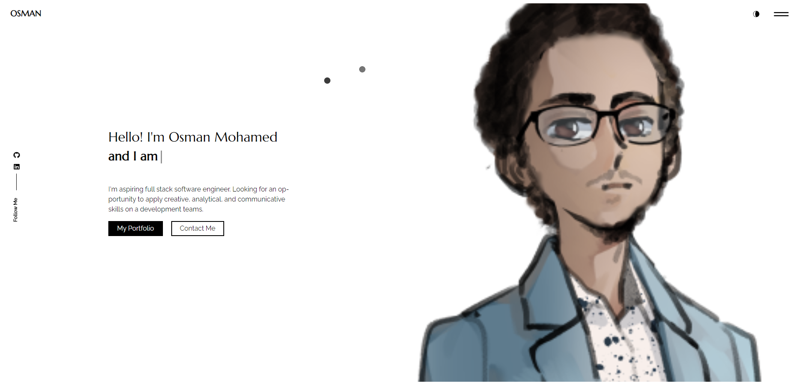

### description

A simple Portfolio template for developer/designers built with React. 

### [live preview](https://osmanmohamed.netlify.app/)

### Features

- Fully Responsive
- Multi-Page Layout
- Contact Form With EmailJs
- React-Bootstrap
- Edit Content From One Place

### Setup

Get the code.

 <pre>git clone https://github.com/omohamed7890/Personal-portfolio.git</pre>
 
Install required dependencies

<pre>yarn install</pre>

modify pages content in  `src/content_option.js`.

statrt the server

<pre>yarn start</pre>

### Thanks

